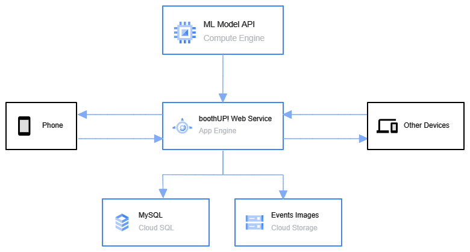

  

<h1 align="center">boothUP! Web Service</h1>

  

boothUP! Web Service is a web service that allows SMEs to search for stall availability for them to sell their products based on their preferences, which are their location and what category of events/tradeshows they're interested to.

> Base URL of this service is:  http://localhost:8080/ (The deployed base url is not included due to protecting data such as user information)

Services available:

- Authentications
  <pre>POST /register</pre>
  <pre>POST /login</pre>
  <pre>POST /logout</pre>
  <pre>GET /token</pre>

- Users
  <pre>GET  /users</pre>
  <pre>GET  /users/{user_id}</pre>

- Events
  <pre>GET  /events</pre>
  <pre>GET  /events/{event_id}</pre>

- Ratings
  <pre>GET  /ratings</pre>
  <pre>GET  /ratings/{rating_id}</pre>
  <pre>GET  /events/{event_id}/ratings</pre>
  <pre>GET  /users/{user_id}/ratings</pre>
  <pre>POST /ratings</pre>
  <pre>DEL  /ratings/{rating_id}</pre>

- User Likes
  <pre>GET  /users/{user_id}/likes</pre>
  <pre>POST /users/{user_id}/likes</pre>
  <pre>DEL  /users/{user_id}/likes/{event_id}</pre>

- Recommendation Results
  <pre>GET  /users/{user_id}/recommendation-results</pre>
  
# Quick Look

## Architecture

  

