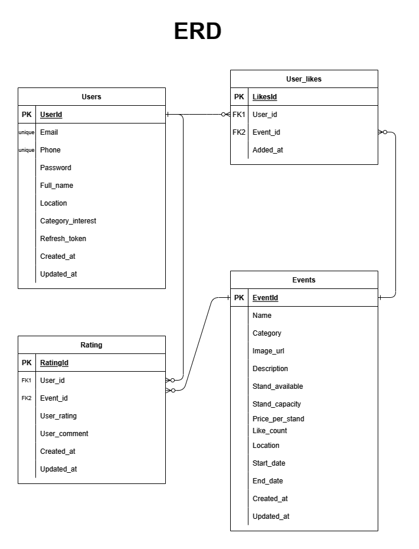

<p align="center">
  
</p>

<h1 align="center">boothUP! Web Service</h1>

<div align="center">

[](#cc-member)
  
</div>

boothUP! Web Service is a web service that allows SMEs to search for stall availability for them to sell their products based on their preferences, which are their location and what category of events/tradeshows they're interested to.

> Base URL of this service is: http://localhost:8080/ (The deployed base url is not included due to protecting data such as user information)

Services available:

- Authentications
  <pre>POST /register</pre>
  <pre>POST /login</pre>
  <pre>POST /logout</pre>

- Users
  <pre>GET  /users</pre>
  <pre>GET  /users/{user_id}</pre>

- Events
  <pre>GET  /events</pre>
  <pre>GET  /events/{event_id}</pre>

- Ratings (not yet implemented in the front-end)
  <pre>GET  /ratings</pre>
  <pre>GET  /ratings/{rating_id}</pre>
  <pre>GET  /events/{event_id}/ratings</pre>
  <pre>GET  /users/{user_id}/ratings</pre>
  <pre>POST /ratings</pre>
  <pre>DEL  /ratings/{rating_id}</pre>

- User Likes
  <pre>GET  /users/{user_id}/likes</pre>
  <pre>POST /users/{user_id}/likes</pre>
  <pre>DEL  /users/{user_id}/likes/{event_id}</pre>

- Recommendation Results
  <pre>GET  /users/{user_id}/recommendation-results</pre>
  
# Quick Look

## Architecture

<p align="center">
  
</p>

# Authentications
This service uses token authentication for secure access. To access the service, create an account and obtain a token. The token is composed of two parts: accessToken and refreshToken, with the accessToken valid for 30 days. To refresh the token, send the refreshToken to the service. 
Follow these steps to ensure secure access: 
- Create an account, obtain a token.
- Use the token to access the service,
- And refresh the token if it expires.

By following these steps, you can ensure secure access to the service and keep your data safe.

# Features
## Recommendations Service
Recommendation service is work based on user's preferences: location and what kind of event/tradeshow category they're interested to. These two are inputted in the registration process. After the system get the user's data, the machine learning process will match the user's preferences with the event/tradeshow preferences. The results are the best match of both.
## Search Events by Location (not yet implemented in the front-end)
Users can search events by their location, make it easier to the user to find suitable events.

# Environment
To successfully run this project, you must properly configure the required environment variables. These variables are necessary to ensure that the project functions as intended.
Please be sure to set the following environment variables:
```bash
ACCESS_TOKEN_SECRET = {define your own token key}
REFRESH_TOKEN_SECRET = {define your own refresh token}

DB_HOST = {database host}
DB_USER = {database username}
DB_PASSWORD = {database password}
DB_NAME = {database name}
```
Without properly setting these environment variables, the project may not function correctly.
You can create your own database using the following image:

<p align="center">
  
</p>


## Dependencies

* [Express](https://www.npmjs.com/package/express)
* [JWT](https://www.npmjs.com/package/@hapi/jwt)
* [Bcrypt](https://www.npmjs.com/package/bcrypt)
* [DotEnv](https://www.npmjs.com/package/dotenv)
* [CORS](https://www.npmjs.com/package/cors)
* [MySQL2](https://www.npmjs.com/package/mysql2)
* [Sequelize](https://www.npmjs.com/package/sequelize)
* [Cookie-parser](https://www.npmjs.com/package/cookie-parser)


# API Documentation
To learn more about the API and its features, we recommend that you read the API documentation. This documentation provides detailed information on how to use the API and its endpoints. By reviewing the documentation, you can gain a better understanding of the API and how it can be integrated into your project. 

You can access the API documentation by visiting the following link. We encourage you to take the time to review the documentation thoroughly to ensure that you are using the API effectively and efficiently.

API documentation: https://boothup.notion.site/Dokumentasi-API-9e59e1225d224cd2a46177c05e99307e?pvs=4
